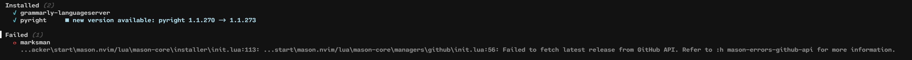
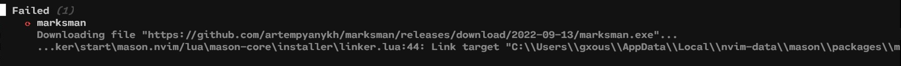
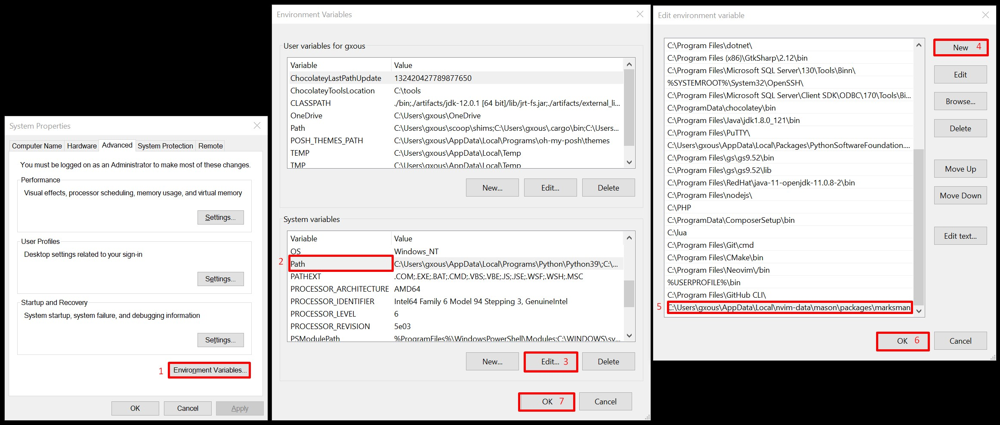

# Intro
`last update : 28/9/2022`

If you tried `LspInstall marksman` and had both or one of those issues, above:

 Then here's a way to make it work.

# Steps
* Install [GitHub CLI](https://cli.github.com/)
* Download the latest [marksman.exe](https://github.com/artempyanykh/marksman/releases)
* Go-To `%AppData%\..\Local\nvim-data\mason\packages\` and create a `marksman` fodler there
* Drop the [marksman.exe](https://github.com/artempyanykh/marksman/releases) insede that folder
* Now `Edit the system environment variables` and add the path where the .exe file is, to the `Path`

* Restart Neovim and you are good to go
